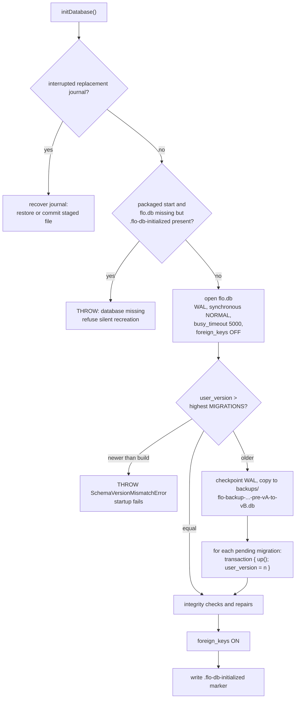

# Data and migrations

FloCafe stores everything in one SQLite file managed with `better-sqlite3`. Schema change is
append-only and versioned. This page covers where the file lives, how a version becomes a
migration, what protects customer data on the way, and how to verify all of it.

The code is [`main/db.ts`](../../main/db.ts). It is large and owns more than the schema; the
sections below are the parts a contributor needs in order to change it safely.

## Database location

`getDbPath()` resolves the file in this order:

1. `FLO_E2E_DB_PATH`, resolved to an absolute path, when set. The native Playwright suites use this
   to point at a disposable database; it has no effect on a normal install.
2. `app.getPath('userData')` in a packaged build.
3. The project root in an unpackaged run, computed from the compiled output location.

The file is named `flo.db`. The backup directory is `backups/` under `userData`, and the
first-start marker is `.flo-db-initialized` under `userData`.

## Connection pragmas

`initDatabase()` opens the file and sets, in order:

| Pragma | Value | Why |
| --- | --- | --- |
| `journal_mode` | `WAL` | readers do not block the writer, which matters because three servers read concurrently. |
| `synchronous` | `NORMAL` | the durability trade that WAL mode is chosen for. |
| `busy_timeout` | `5000` | wait rather than fail when another connection holds a write lock. |
| `foreign_keys` | `OFF`, then `ON` | disabled across the migration batch, re-enabled immediately after. |

A WAL database has sidecar `-wal` and `-shm` files. Anything that copies the live database, including
the pre-migration backup, checkpoints with `wal_checkpoint(TRUNCATE)` first so the copy is
self-contained.

## The migration registry

`MIGRATIONS` is an exported, append-only array of `{ version, name, up }`. **There are 92 entries,
numbered 1 through 92 with no gaps and no duplicates**, and the highest is `version: 92`. The
highest entry is `add_table_reservation_customer`.

Two rules follow from the array being the registry:

- **Never renumber, reorder, or remove an entry.** The version number is the persisted contract with
  every install that has already run it.
- **Never edit a shipped `up`.** It has already run on real databases. A new entry is the only way
  to change the schema.

`getCurrentSchemaVersion()` reads `PRAGMA user_version`, and that pragma is the single source of
truth. It is not inferred from the tables, and it is not tracked in a separate settings row.

## The two fail-closed rules

Startup refuses to continue in two situations, and both exist to protect customer data:

1. **A missing database on a previously initialized install.** If this is a packaged start, the
   database file is absent, and `.flo-db-initialized` exists, `initDatabase` throws rather than
   creating a fresh empty file. A silently recreated empty database would look like a working POS
   with no orders. The error tells the user to restore from a backup. A genuinely fresh install has
   no marker and proceeds normally.
2. **A database newer than the build.** If `user_version` is greater than the highest migration in
   this build, `runMigrations` throws `SchemaVersionMismatchError`. An older build must not open a
   newer schema, because the migrations it does know how to run would be the wrong ones. Startup
   fails with both version numbers reported to telemetry.

## The automatic pre-migration backup

Before any pending batch runs, `syncBackupBeforeMigration` writes a snapshot into
`backups/flo-backup-<timestamp>-pre-v<from>-to-v<to>.db`. On a brand-new install, where no source
file exists yet, it still creates the file so the backup contract holds, and stamps it with the
pre-migration version.

The snapshot is a real SQLite file, not a raw copy alone. It is reopened, switched to
`journal_mode = DELETE` so it is portable away from WAL, and given an `_flo_meta` table recording
`schema_version` and `backup_created_at`, with `user_version` set to the pre-migration value.

`getBackupDir()` always points at `userData`, even in an unpackaged run, so backups never accumulate
inside the repository.

## Startup integrity work

After migrations and with `foreign_keys` re-enabled, startup runs:

- `runStartupIntegrityCheck` - `PRAGMA integrity_check` and `PRAGMA foreign_key_check`. A failed
  integrity check is recorded in `dbHealthError`, which is what the health endpoints report; it
  does not by itself abort startup.
- `repairSequences` - re-seeds the per-day order and bill number sequences from existing rows, which
  prevents unique-constraint collisions on numbering.
- `autoRepairPaymentDetails` and `autoRepairDefaultPrinter` - the two targeted data repairs.

## Backup and restore

| Operation | Entry point | Notes |
| --- | --- | --- |
| Create a backup | `createBackup(targetPath?, signal?, options?)` | Runs under the database maintenance lock, so it cannot overlap another backup, restore, or wipe. Returns the path and the schema version. |
| List backups | `listBackups()` | Reports file name, path, size, creation time, `manual` or `auto` kind, and the schema version when readable. |
| Restore a backup | `restoreBackup(backupPath, forceDirect?, signal?)` | Also under the maintenance lock. |

Backup, restore, and wipe are serialised by one lock. Two of them running at once is the failure
mode that corrupts a database, so any new entry point in this area must take the same lock.

`restoreBackup` reads the `_flo_meta` stamp and the `user_version` pragma from the backup and
decides between a direct file replacement and a data-only restore from the metadata. An unreadable
source returns a structured failure with both versions rather than throwing.

### Durability

Replacement is journalled, not best-effort. `writeReplacementJournal` writes a temporary file,
`fsync`s it through a writable handle, renames it into place, and then `fsync`s the containing
directory. The journal records a `prepared` or `committed` phase, and
`recoverInterruptedDatabaseReplacement` replays it on the next start: an interrupted replacement
either completes or is rolled back to a `.cleanup-<id>` copy. `isLiveDatabaseTarget` prevents a
replacement from overwriting the live database or a hard link to it.

`syncFile` uses `fs.openSync(path, 'r+')` plus `fs.fsyncSync` so the flush is portable to Windows.
Directory syncing is skipped on Windows, which does not support it.

## Verification commands

| Command | Covers |
| --- | --- |
| `npm run audit:db` | The database audit: schema, data, and consistency checks over the repository's expectations. |
| `npm run test:upgrade-path` | Migration from historical snapshots up to the current version. |
| `npm run test:upgrade-regression` | Regression cover for past migration defects. |
| `npm run test:upgrade-matrix-harness` | The harness the CI upgrade matrix drives. |
| `npm run test:schema-health` | Schema shape and index health. |
| `npm run test:backup` | Backup and restore behaviour. |
| `npm run test:issue-278-fail-closed-db` | The missing-database guard. |

`isHealthyDatabaseFile` is the predicate that decides whether a candidate file is usable at all. It
requires a clean `integrity_check`, no foreign-key violations outside an explicit allowlist, a
schema version above zero and within the supported range, an `_flo_meta` stamp that matches the
pragma, and a table and column set, plus normalised `CREATE` definitions, that match the ideal
schema built by running the whole migration pipeline in memory.

## Adding a migration

1. Append a new entry to `MIGRATIONS` with the next version number, a `snake_case` name, and an
   `up` that is safe to run once against a database that has data.
2. Never touch an existing entry.
3. If the change adds a table, a column, or an index that the recovery path needs, verify the
   change is reflected in the expected-schema reference the health predicate uses.
4. Add test vectors that exercise the migration from a populated database, not from empty.
5. Run `npm run test:upgrade-path`, `npm run test:upgrade-regression`, and `npm run test:backup`, and
   run `npm run audit:db`.

## Timestamps

`now()` returns the SQLite `CURRENT_TIMESTAMP` format, `YYYY-MM-DD HH:MM:SS`, in UTC. Read a stored
timestamp with `parseDbTimestamp`, never with a bare `new Date(string)`. See
[Business time](business-time.md).
