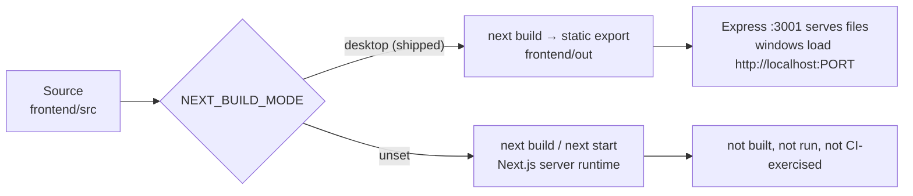

# Desktop build and window surfaces

The desktop build is a statically exported Next.js site served by Express, not a Next.js server.
Everything dynamic lives in the main process. This page states the boundary, because violating it
produces code that looks reasonable in a local build and has nowhere to run in a shipped one.

## The build-time fork

[`frontend/next.config.ts`](../../frontend/next.config.ts) reads `NEXT_BUILD_MODE`. When it equals
`desktop`, three settings change:

| Setting | Desktop | Otherwise |
| --- | --- | --- |
| `output` | `'export'` | `undefined` (server runtime) |
| `trailingSlash` | `true` | default |
| `images.unoptimized` | `true` | default |

`npm run build:frontend` sets `NEXT_BUILD_MODE=desktop`, so that is the build the application ships.

## What does not exist in the desktop build

The export target has no server runtime, so the following are absent, and their absence is not
something the build reports. A route handler or a server action added under `frontend/src` compiles
without complaint and is dead code in every shipped build.

- No Next.js server runtime, and therefore no server-side rendering.
- No route handlers: there is no `route.ts` anywhere under `frontend/src`, and no
  `frontend/src/app/api` directory.
- No middleware: there is no `middleware.ts`.
- No server actions: no `'use server'` directive anywhere under `frontend/src`.
- No server cookies, and no server-only APIs such as `next/headers`.
- No image optimisation, because it requires a running server.

Of the 116 `.tsx` files under `frontend/src`, 92 open with `'use client'`. The renderer is the
norm, not the exception.

**All dynamic backend logic belongs in Express on `:3001`, or in Electron IPC for native
capabilities.** If a route needs a database row, a payment calculation, or a printer, it is an
Express route.

## The HTTP data plane

The renderer talks to the API over HTTP against a same-origin base URL, which is why the main
server serves the exported frontend from the same origin it serves `/api` on.

`main/server.ts` mounts the API routers first and serves static files afterwards, so `/api/*` is
never captured by the static fallback. The catch-all route for application pages is
`app.get(/^(?!\/api|\/kds).*$/, ...)`: it deliberately excludes both the API prefix and the KDS
WebSocket path. `resolveStaticPage` maps a route to its own exported `index.html` and refuses to
build a path that would escape the export directory; unknown or unsafe paths fall back to the root
page.

On Windows a middleware rewrites dotted `__next.` chunk requests, because Windows path handling
does not preserve the nesting the export emits elsewhere.

## The native IPC surface

IPC is a narrow native surface, not a second data plane. The renderer reaches native capability
through `main/preload.ts`, which exposes a `contextBridge` object. The window set is small: window
controls, window state, opening the KDS window, update status, database initialization, and the
theme handshake.

The main window is created with `contextIsolation: true`, `nodeIntegration: false`, and
`sandbox: false`. `sandbox: false` is a deliberate choice recorded in
[Authentication and authorization](authentication-and-authorization.md); do not change it as a
drive-by cleanup.

## The native title bar

The main window is 1400x900 with a minimum of 1024x768, is created hidden, and is shown only once
its renderer reports ready (see the readiness contract below).

### Mode resolution

`resolveTitleBarMode` in [`main/window-options.ts`](../../main/window-options.ts) returns
`native-overlay` or `html-fallback`:

| Platform | Result |
| --- | --- |
| Not `darwin`, `win32`, or `linux` | `html-fallback` |
| `darwin` | `native-overlay` - macOS supplies traffic lights natively and never needs HTML buttons |
| `win32` or `linux` | `native-overlay` only when the Electron major version is at least 33 **and** `BrowserWindow.prototype.setTitleBarOverlay` is a function; otherwise `html-fallback` |

The probe is capability-based: it asks the runtime what it can do. It does not inspect a user-agent
string, and it must not grow one. The resolved mode is reported to the renderer through the
`get-status` IPC handler as `titleBarMode`, alongside the readiness epoch and document nonce.

### Window options

`titleBarStyle` is `'hiddenInset'` on macOS and `'hidden'` elsewhere. On macOS,
`trafficLightPosition` is set to `{ x: 16, y: 14 }`, which centres the 12-pixel traffic-light
buttons in the 40-pixel custom title bar. When the mode is `native-overlay`, `titleBarOverlay` is
supplied with the theme colours and `TITLE_BAR_HEIGHT` (40).

### The top-level application menu

`titleBarStyle: 'hidden'` makes the main window frameless on Windows and Linux, and Electron creates
no menu bar for a frameless window, so `Menu.setApplicationMenu` still registers the accelerators but
draws nothing. [`ApplicationMenuRow`](../../frontend/src/components/layout/ApplicationMenuRow.tsx)
renders the top-level labels inside the title bar's safe area and opens the matching submenu through
the `open-application-menu` IPC.

`createMenu()` is the single source of the menu. `get-application-menu` returns only the descriptor a
label needs, and `open-application-menu` pops the same `Menu` object that was applied, so roles,
accelerators, and click handlers are the native ones. The popup is a privileged native surface, so the
handler binds the request to the main window's own `webContents` and current renderer frame rather
than relying on the trusted-origin check alone, which the KDS window also passes.

macOS keeps its native top-level menu: the handler returns an empty entry list on `darwin` and the
renderer draws nothing.

### Theme

[`main/title-bar-theme.ts`](../../main/title-bar-theme.ts) owns the palette: white background with
near-black symbols in light mode, and the inverse in dark mode. `resolveThemeMode` reads the
`theme_mode` setting and resolves anything absent, null, or unrecognised to `system`;
`resolveInitialIsDark` then defers to the OS signal only in `system` mode.

`applyTitleBarOverlayTheme` returns `false` without touching the window on any platform other than
macOS and Windows, so **on Linux a runtime overlay theme update is a no-op**, and it also returns
`false` rather than throwing when a window manager rejects the change, so the last applied colours
survive. `attachTitleBarThemeSync` subscribes to `nativeTheme` updates on the same two platforms and
is inert elsewhere.

### The window-control verb set

The renderer's HTML fallback controls and the top bar's native toggle use one IPC verb set, exposed
as `windowAction` on the preload bridge and handled by the `window-action` channel. Exactly three
actions are accepted:

| Action | Effect |
| --- | --- |
| `minimize` | minimize the window |
| `toggle-maximize` | leave full screen if in it, otherwise unmaximize or maximize |
| `close` | close the window, which hides it unless quitting |

Any other value returns `{ error: 'Unsupported window action' }`. Keep the set at three verbs. Each
new verb is a new native capability the renderer can reach, and the set exists to stay narrow.

### Renderer readiness, epoch, nonce, and the fail-safe

[`main/window-readiness.ts`](../../main/window-readiness.ts) stops a window from being shown before
its controls exist.

- Each new document begins an **epoch**. `beginRendererDocument()` increments the epoch, clears the
  recorded nonce, and arms the fail-safe timer. A main-frame navigation that is not same-document,
  as decided by `isFullDocumentMainFrameNavigation`, starts a new epoch.
- The preload generates a UUID once per document and sends it to the main process with
  `sendSync`. `registerRendererDocument` accepts it only if it matches a UUID v4 pattern.
- The renderer reports ready with its epoch and that nonce. `markWindowRendererReady` accepts the
  report only when the epoch is the current one, is an integer of at least 1, and the nonce matches
  the registered one. Stale reports from a replaced document are rejected.
- Only then does `isWindowRendererReady` return true, and only then does `showMainWindow` show the
  window.
- A 10-second fail-safe timer runs alongside. If the renderer never confirms, the window is shown
  anyway and an error is logged. A window with no working caption buttons is better than an
  invisible window; the timer records that the fail-safe fired through
  `isRendererReadinessFailSafeShown`, which is itself part of the gate in `showMainWindow`.

`isCurrentRendererFrame` matches a sender frame against the live frame by `frameToken` and rejects
detached frames, which is how handlers confirm the caller is the live renderer.

## Other window surfaces

| Window | Module | URL | Preload |
| --- | --- | --- | --- |
| POS | `createMainWindow` | `http://localhost:<main port>` | yes |
| KDS | `createKdsWindow` | `http://<LAN IP>:<kds port>/kds` | no |
| Server app | served page | `http://localhost:<server app port>/server-standalone` | no |

The KDS window deliberately has no preload and learns its palette from a `theme` query parameter
appended by `appendThemeQueryParam`. It is confined to its own origin: window-open requests are
denied outright, and navigation away from the KDS origin is prevented.

`target="_blank"` links in the POS window are opened in a new window only when the URL passes the
local allowlist check in [`main/security/url-allowlist.ts`](../../main/security/url-allowlist.ts).
Safe external URLs open in the system browser; anything else is refused with a warning.

## Content Security Policy

`buildCspHeader` in [`main/csp.ts`](../../main/csp.ts) applies to responses from the local servers.
The base policy is `default-src 'self'`, with `script-src` and `style-src` at `'self'`
`'unsafe-inline'`, `img-src` and `font-src` at `'self' data:`, and `frame-ancestors 'none'`.
`connect-src` additionally admits `http:`, `ws:`, and `wss:` for the request's own `Host` origin,
but only when that header matches a safe host pattern, so a hostile `Host` cannot smuggle extra
directives.

Note that `script-src` permits inline script. `eval` is not permitted. Adding a nonce or hash policy
here is a security change with its own review, not a documentation edit.
