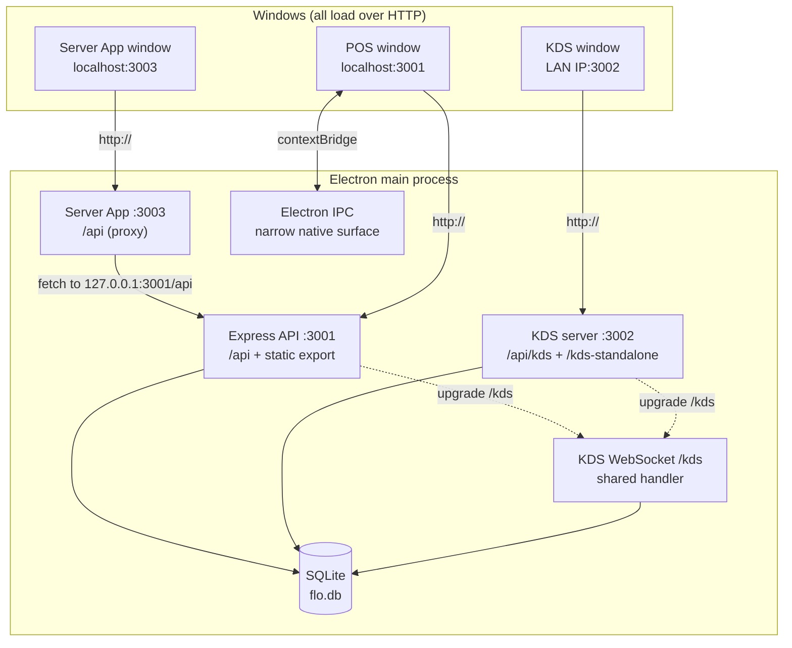

# System overview

FloCafe is an offline-first Electron desktop point-of-sale application. One Electron main process
hosts a SQLite database, three HTTP servers, and a set of native window surfaces. There is no
separate backend host: the API server, the kitchen display server, and the server app server all
run inside the same process as the UI.

This page is the map. Each server and lifecycle rule has its own page; see the links at the end.

## Processes and ports

| Surface | Default port | Module | Purpose |
| --- | --- | --- | --- |
| Main API and POS UI | `3001` | [`main/server.ts`](../../main/server.ts) | REST API under `/api`, the static-export frontend, and the KDS WebSocket upgrade. |
| Kitchen Display | `3002` | [`main/kds-server.ts`](../../main/kds-server.ts) | Standalone KDS page and KDS REST endpoints, for a second screen or a tablet. |
| Server App | `3003` | [`main/server-app.ts`](../../main/server-app.ts) | A narrow ordering surface for server staff, backed by a filtered proxy to `:3001`. |

The KDS WebSocket is served at path `/kds` on **both** `:3001` and `:3002`. Both servers call the
same handler, `setupKdsWebSocket` in [`main/services/kds.ts`](../../main/services/kds.ts), so a
KDS client behaves identically whichever port it connects to.

## Every window loads over HTTP

No window loads a `file://` URL. The POS window loads
`http://localhost:<main port>` so that the browser sees a single HTTP origin, which avoids
`file://` CORS and routing problems and keeps development and packaged behaviour identical. The
KDS window loads `http://<LAN IP>:<kds port>/kds`. The server app window loads its own origin on
`:3003`.

The main server also serves the static frontend export when it can find it, looking for
`frontend/out/` relative to the compiled output and `resources/frontend-out` in a packaged build.
When the export is missing it serves a placeholder page telling the developer to run
`npm run build:frontend` rather than failing.

## The port retry ladder

Each server resolves its own port at bind time rather than assuming the default. On `EADDRINUSE`
or `EACCES` it increments the port and retries, up to ten attempts measured from the base port,
before rejecting. Because the active port can differ from the default, nothing may hard-code
`3001`, `3002`, or `3003`.

Read the live port from the accessor, never from a literal:

| Constant | Read with |
| --- | --- |
| Main API | `getServerPort()` from [`main/server-state.ts`](../../main/server-state.ts) |
| KDS | `getKdsPort()` |
| Server App | `getServerAppPort()` from [`main/server-app-state.ts`](../../main/server-app-state.ts) |

Defaults come from the `PORT`, `KDS_PORT`, and `SERVER_APP_PORT` environment variables.

## LAN discovery

On startup the app publishes an mDNS service named `Flo` of type `http` on host `flo`, so the POS
resolves at `flo.local:<main port>` on the LAN. The TXT record carries the app version and the
paths and ports of the KDS and server app surfaces, and the startup log prints the LAN IP as a
fallback for networks where mDNS resolution fails.

mDNS advertisement is skipped when `FLO_E2E_SKIP_OPTIONAL_NETWORK` is `1`, which is how the
end-to-end suites keep an offline fixture uncontended.

## The server app is a filtered proxy, not a second API

`main/server-app.ts` does not implement business logic. It authenticates the caller, checks the
role against the server-app role set, and then forwards a fixed list of paths to
`http://127.0.0.1:<main port>/api/...` with a real `fetch`, relaying method, query string,
`Authorization` header, `Idempotency-Key`, and JSON body, and copying the upstream status and body
back.

Two consequences matter when you work on it:

- **Adding an endpoint to `:3001` does not expose it on `:3003`.** A path becomes reachable from
  the server app only when an explicit forwarding route is added to `main/server-app.ts`.
- **An unreachable main API surfaces as `502`** from the forwarding layer, and an aborted request
  as `503`.

When the server app feature is disabled, the authenticated middleware answers `404` rather than
revealing that the surface exists.

## Capability-based title bar detection

Whether the main window uses native caption controls or HTML fallback buttons is decided by probing
the platform and the runtime, never by inspecting a user-agent string. `resolveTitleBarMode` in
[`main/window-options.ts`](../../main/window-options.ts) returns `native-overlay` for macOS, and for
Windows and Linux only when the Electron major version is at least 33 **and**
`BrowserWindow.prototype.setTitleBarOverlay` is actually a function; otherwise it returns
`html-fallback`. The resolved mode is reported to the renderer through the `get-status` IPC handler.

See [Desktop build and window surfaces](desktop-build.md) for the rest of the title-bar contract.

## Where to go next

| Subject | Page |
| --- | --- |
| Startup order, shutdown order, runtime recovery, and the dev-server divergence | [Runtime and lifecycle](runtime-and-lifecycle.md) |
| Static export boundary, IPC surface, title bar | [Desktop build](desktop-build.md) |
| Database file, migrations, backup and restore | [Data and migrations](data-and-migrations.md) |
| Stored timestamps and business-day boundaries | [Business time](business-time.md) |
| Auth, roles, and the boundaries the app does not harden | [Authentication and authorization](authentication-and-authorization.md) |
| Print pipeline, renderers, transports | [Printing](printing.md) |
| Tax engine and data-only packs | [Taxation](taxation.md) |
| Optional network features and offline degradation | [Cloud integrations](cloud-integrations.md) |
